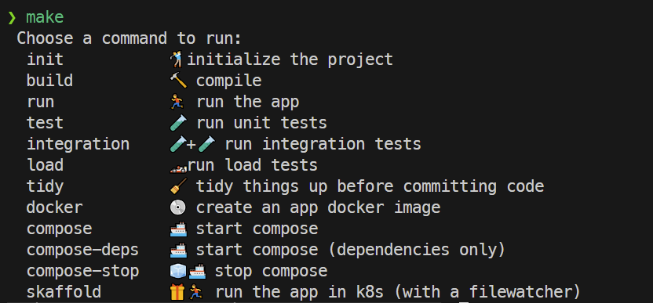

# PORTFOL.IO
PoC of a portfolio-tracking api

## SYSTEM DEPENDENCIES
- node 24 + npm
- postges

## DEV SYSTEM DEPENDENCIES
- make (general runner)
- nvm (multi-project node versioning)
- docker
- kubernetes (docker-desktop has k8s built in)
- helm (k8s package manager)
- skaffold (file-watch deployment to local k8s)
- k6 (load testing)

## GETTING STARTED


## RUNNING THE APP

### Native (Node.js)

```bash
make init   # first time only
make run
```

The app will be available at `http://localhost:3000`.

### Containerised (Docker Compose)

Starts the app and PostgreSQL:

```bash
make compose
```

To start dependencies only (e.g. when running the app natively or via k8s):

```bash
make compose-deps
```

Stop all services:

```bash
make compose-stop
```

### Local Kubernetes (Docker Desktop)

Requires Docker Desktop with Kubernetes enabled. Starts the app in the local k8s cluster with file watching — any source change triggers a rebuild and redeploy.

Start PostgreSQL first (the k8s app connects to it via `host.docker.internal`):

```bash
make compose-deps
```

Then deploy to k8s:

```bash
make skaffold
```

The app will be port-forwarded to `http://localhost:3000`.


## RUNNING TESTS

### Unit Tests

Runs all unit tests with coverage. No external dependencies required.

```bash
make test
```

Coverage output is written to `coverage/lcov.info` and can be visualised in VS Code with the [Coverage Gutters](https://marketplace.visualstudio.com/items?itemName=ryanluker.vscode-coverage-gutters) extension.

### Integration Tests

Requires the app to be running (e.g. via `make compose` or `make compose-deps && make run`).

```bash
make compose        # start app + postgres
make integration
```

Target URL defaults to `http://localhost:3000`. Override with the `BASE_URL` environment variable.

### Load Tests

Requires the app to be running and [k6](https://k6.io) installed.

```bash
make compose        # start app + postgres
make load
```

Runs 20 virtual users for 30 seconds (1s ramp-up + 29s sustained). Exits non-zero if any checks fail.

Target URL defaults to `http://localhost:3000`. Override with `BASE_URL`:

```bash
BASE_URL=http://my-env:3000 make load
```
(note the 2-3x performance difference if LOG_LEVEL is set to error)

## AI
- the majority of the code is AI generated, but proof-read
- the prompts are in the `prompts/` folder, and are hand-written
- the bulk of the intellectual property is there

## DESIGN DECISIONS

### Language
- i've decided to go with typescript
- alternatively, for some hand-cut async/await/event-loop python with typing (via MyPy) and good performance, please take a look at my github repo https://github.com/milsanore/bi5importer
- for additional performance improvement on the python side, a JIT compiler like PyPy could work, but it was a diminishing return for the repo above because the code is IO-heavy, so the bulk of the improvement was in the event loop / async work

### Libraries
- i'm moving from express to fastify to see what performance is like

### Other
- not using a base-10 number type (e.g. decimal.js) yet, because it doesn't appear warranted. this may change

## TODO
- add a Makefile
- configure sonarcloud
- configure the conventional commit regex in the github project
- middleware (e.g. helmet/CORS/authentication/etc)
- if the build pipeline is slow, create a custom build image and host it in ghcr
  - e.g. the build image for my trader.cpp app: https://github.com/milsanore/trader.cpp/pkgs/container/tradercppbuild
- semantics
  - boolean naming convention
  - snake_case in general
- observability (correlation IDs, otel + a back end)
- node file watcher (nodemon)
- module in package.json / tsconfig
- add coverage numbers to jest run
- tsc debug/release builds, source maps
- disable merging to master without a PR
- circuit breaking
- automated tags + semver (based on conventional commit)
- image registry (dockerhub/ghcr)
- HTTP security headers (helmet)
- Rate limiting
- Request size limits
- can we use a binary format for time series in the future
- https://github.com/TheBrainFamily/wait-for-expect for integration tests
- migration container + node-pg-migrate as a dev dependency
- CHECK constraint for mandatory JSONB fields
- dynamic field names in the import script
