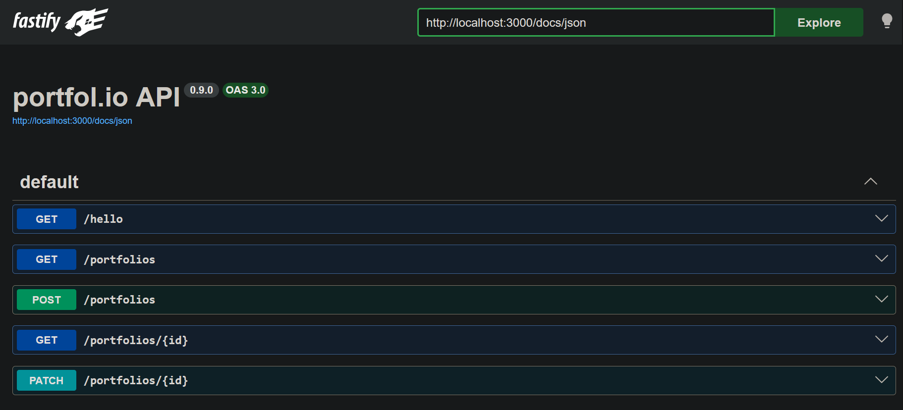
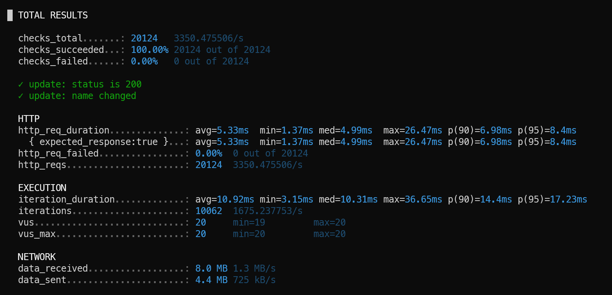

# PORTFOL.IO

portfolio-tracking api

## SYSTEM DEPENDENCIES
- node 24 + npm
- postgres

## DEV SYSTEM DEPENDENCIES
- make (general runner)
- nvm (multi-project node versioning)
- docker
- kubernetes (docker-desktop has k8s built in)
- helm (k8s package manager)
- skaffold (file-watch deployment to local k8s)
- k6 (load testing)

## GETTING STARTED


## RUNNING THE APP

### Native (Node.js)

```bash
make compose-deps # dockerised postgres database, if you need it
make init         # first time only
make run
```

- The app will be available at `http://localhost:3000`
- Swagger at `http://localhost:3000/docs` (NB: fully driven by `schemas.json`)



### Containerised (Docker Compose)

Starts the app and PostgreSQL:

```bash
make compose
```

To start dependencies only (e.g. when running the app natively or via k8s):

```bash
make compose-deps
```

Stop all services:

```bash
make compose-stop
```

### Local Kubernetes

You can use Docker Desktop with Kubernetes enabled. Starts the app in the local k8s cluster with file watching.

Start PostgreSQL first (the k8s app connects to it via `host.docker.internal`):

```bash
make compose-deps
```

Then deploy to k8s:

```bash
make skaffold
```

The app will be port-forwarded to `http://localhost:3000`.
Any file changes will trigger a rebuild and redeploy to k8s.

## RUNNING TESTS

### Unit Tests

Runs all unit tests with coverage. No external dependencies required.

```bash
make test
```

Coverage output is written to `coverage/lcov.info` and can be visualised in VS Code with the [Coverage Gutters](https://marketplace.visualstudio.com/items?itemName=ryanluker.vscode-coverage-gutters) extension.

### Integration Tests

```bash
# NB: app must be running
make integration
```

Target URL defaults to `http://localhost:3000`. Override with the `BASE_URL` environment variable.

### Load Tests

Requires the app to be running (incl. the DB) and [k6](https://k6.io) to be installed.

```bash
make load
```



Target URL defaults to `http://localhost:3000`. Override with `BASE_URL`:

```bash
BASE_URL=http://my-env:3000 make load
```
(note the significant performance difference if LOG_LEVEL is set to error)

## AI
- the majority of the code in this repo was AI generated, but proof-read
- the prompts are in the `prompts/` folder, and are hand-written
  - the bulk of the intellectual property is there
  - unfortunately the resultant back-and-forth with Claude is not captured there

## DESIGN DECISIONS

### Language
- i went with typescript. alternatively, for some hand-written async/await/event-loop python with typing (via MyPy) and good performance, please take a look at my github repo https://github.com/milsanore/bi5importer

### Libraries
- i'm moving from express to fastify to see what performance is like
- it also has a tight integration with static api schemas

### Database
- uuids for primary keys - allows for easy scaling / sharding / migrating to nosql
- using postgres with nosql
  - advantages: no ORMs needed (this is a big one for me because many engineers struggle with ORMs), easy migration to nosql, but retain ACID/TRANASCTIONs
  - disadvantages: weaker typing at the DB level, weaker FK constrains

### Other
- not using a base-10 number type yet (e.g. decimal.js), because it doesn't appear warranted. this may change based on requirements
- calcs are based in USD - the app stores a hard-coded table of forex rates
- non-unique data in the sample tick data provided - averaging across all rows as a workaround

## TODO - FUNCTIONAL
- currency
  - is standardised to USD
  - instead, it should follow the customer's portfolio currency
  - exchange rates are currently hard-coded
- app does not support shorting stocks
- missing `customers` collection
- missing `DELETE` endpoints (does regulation stipulate soft-delete?)
- unique key on the portfolios table
  - users can currently create two portfolios with the same name
  - depends on business requirements
- unique key on the transactions table
  - perhaps a composite unique key on portfolio_id + trade_id
  - but needs careful checking for cross-exchange compatibility
- uncertain data size -> even more pagination may be required in production
- portfolio return is only up-to-date as of last the close - it does not account for intraday price movement

## FEATURES
- [integration tests as a second jest suite](tests_integration/jest.config.js) (call out to a real database, perform real return calculations)
- load tests (using k6)
- [statically defined API schema](src/schemas.json)
- [Makefile as a task runner](Makefile)
- [github actions](https://github.com/milsanore/portfol.io/actions)
  - run integration and load tests within the pipeline in 3 minutes (using docker-in-docker)
  - cached postgres image and node_modules in the github pipeline
- [out-of-the-box debugging](.vscode/launch.json)
- [memory-efficient script for importing sample tick data](deployment/postgres/scripts/import-tick-data.ts)
- k8s deployment (via helm chart), with file-watch redeployment (`make skaffold`)
- [git pre-commit hook](hooks/commit_check.sh) for checking formatting, linting, tests
- database
  - containerised
  - prepared statements (via named queries)
  - JSONB documents (no ORM needed, but still get the benefit of transactions)
  - migrations in raw SQL
- unit tests with coverage numbers and coverage-gutters integration
- .env for tracking environment variables
- linting, formatting
- isolated portfolio-return calculation logic for good testability

## TODO - TECHNICAL
- sonarcloud
- observability (correlation IDs, otel + a back end)
- circuit breaking
- rate limiting
- request size limits
- DB `CHECK` constraint for mandatory JSONB fields
- @fastify/response-validation
- HTTP security headers (helmet)
- configure the conventional commit regex in the github project
- automated tags + semver (based on conventional commit)
- disable merging to master without a PR
- middleware (e.g. helmet/CORS/authentication/etc)
- if the build pipeline is slow, create a custom build image and host it in ghcr
  - e.g. the build image for my trader.cpp app: https://github.com/milsanore/trader.cpp/pkgs/container/tradercppbuild
- node file watcher (nodemon)
- module in package.json / tsconfig
- tsc debug/release builds, source maps
- image registry (dockerhub/ghcr)
- can we use a binary format for time series in the future
- db migration container + node-pg-migrate as a dev dependency
- github badges
